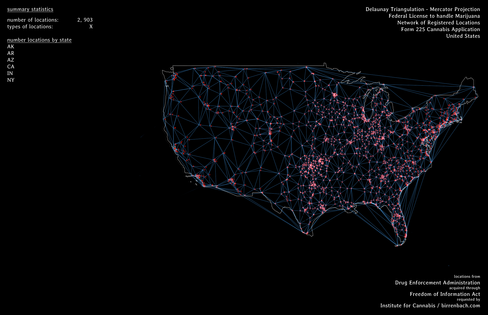

#### Process notes

Notes on the wrangling process; intentions and points to improve.

- [Registration Date wrangling](https://github.com/mozzarellaV8/dea-mj/blob/master/process.md#registration-date-wrangling)
- [Addresses for geocoding](https://github.com/mozzarellaV8/dea-mj/blob/master/process.md#addresses-for-geocoding)
- [Free User geocoding](https://github.com/mozzarellaV8/dea-mj/blob/master/process.md#free-user-geocoding)
- [Missing Values](https://github.com/mozzarellaV8/dea-mj/blob/master/process.md#missing-values)

#### Registration Date wrangling

If there were multiple licenses registered on one day, only one date would be added to the spreadsheet and the rest left empty until a new date with new license info was added. I'd begun by converting the blank values to NAs, and below is an illustration of the issue and desired outcome. 

``` {r}
mj[4, 1]                # [1] "3/1/1991"
mj[5:7, 1]              # [1] NA NA NA
mj[5:7, 1] <- mj[4, 1]  
mj[5:7, 1]              # [1] "3/1/1991" "3/1/1991" "3/1/1991"
```

What I wanated to do was fill in the NA values with the preceding date value. This seemed to be pretty easy using `na.locf` from the `zoo` library.

``` {r}
head(mj$REGISTRATION.DATE)
[1] "12/31/1990" NA           "5/15/1991"  "3/1/1991"   NA           NA

library(zoo)
mj$REGISTRATION.DATE <- na.locf(mj$REGISTRATION.DATE, na.rm = FALSE)

head(mj$REGISTRATION.DATE)
[1] "12/31/1990" "12/31/1990" "5/15/1991"  "3/1/1991"   "3/1/1991"   "3/1/1991"  
```

From there went on to `separate` the dates into their own Month, Date, and Year columns. 

#### Addresses for geocoding

The address information was originally provided in four columns: `ADDRESS.1`, `ADDRESS.2`, `CITY`, and `STATE`. My thinking was, it'd be a mess to try to geocode using information from 4 columns, so through a dirty process ended up united these four into one. Also preserved the `CITY`and `STATE` columns, in the event that those might be quantified for study. 

Ran into an issue when trying to remove trailing commas, but seemed to have found a bad workaround by misusing `gsub`. `",*$"` wouldn't remove the end-of-string commas, so I added a word to each field following the comma and removed that afterwards:

``` {r}
mj$ADDRESS.1[mj$ADDRESS.1 == ""] <- "goddamit"
mj$ADDRESS.2[mj$ADDRESS.2 == ""] <- "goddamit"

mj <- unite(mj, ADDRESS, ADDRESS.1, ADDRESS.2, sep = ", ")

mj$ADDRESS <- gsub("^,*", "", mj$ADDRESS)
mj$ADDRESS <- gsub(", goddamit", "", mj$ADDRESS)
mj$ADDRESS <- gsub("goddamit", "", mj$ADDRESS)
```

Not a proud moment, but will be continuing to learn the nuances of regex and approaches to handling different kinds of messy data. Although now that I think of it, `"goddamit"` could have been replaced with `NA` from the start. 

#### Free User geocoding

`ggmap` pulls geocoding requests from Google Maps Geocoding API, which has a limit in place for 2500 requests per day. It's possible to bypass this limit by aquiring an API key and enabling billing for a 'pay as you go' plan for higher quotas - $0.50 USD per 1000 additional requests, up to 100,000 daily.

The other way to bypass this quota is to have an enterprise account / premium usage plan. 

In the spirit of open access, I simply divided the [geocoding script](geocode-free.R) so that it could be done in two parts over two days. 

Looking ahead, I may look into writing something using `RCurl` to retrieve latitude and longitude information from OpenStreetMap. 

#### Missing Values

There are 88 missing lat/lon values out of the 2953 total observations. A quick look reveals that some of the addresses were not completely clean from the DEA's original list. That's not chill - going to have to go in and investigate.

#### Mapping - round 01

a map in progress - figuring out the relationship between presenting the information and how to draw further conclusions from the information.



Some initial failures include: thinking WGS84 projection would make the continental US look normal. I actually still haven't found Proj4 encoding for a decent continental US yet...although for geojson this doesn't seem to be a problem. It might be time to convert. 

